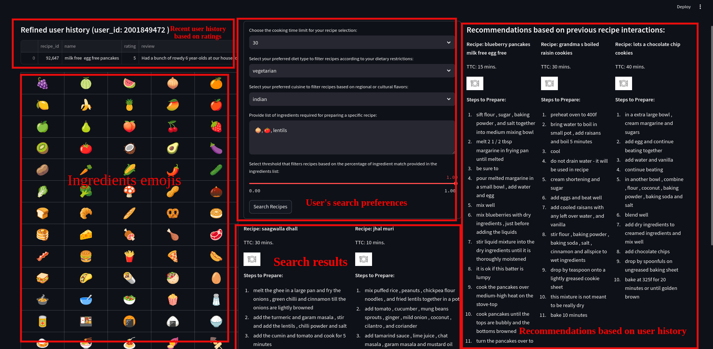
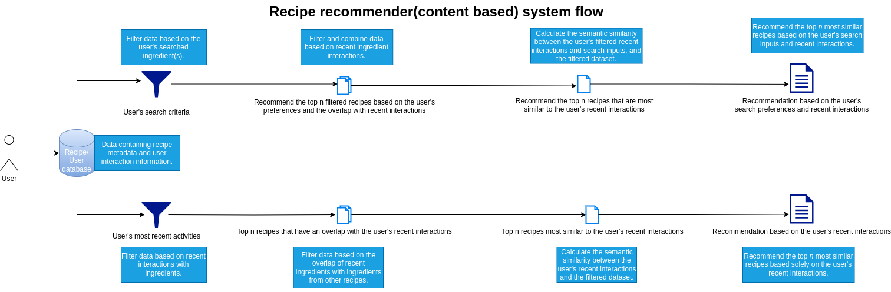

# Recipe Recommender

A straightforward content-based recommendation system that leverages user preferences and previous interactions.

### Web app UI


### Recommender logic flow diagram



### Recommender logic flow (content based)

1. Data Loading
* Load datasets containing user and recipe information.

2. Data Preprocessing
* Transform the tags and ingredients columns into sets to ensure there are no duplicate values.
* Generate BERT embeddings for the ingredients column to enable semantic search.

3. Filtering Based on Explicit User Preferences
* Apply filters to the recipes based on criteria such as preparation time, cuisine, and diet type.
* Calculate the overlap between the filtered recipes' ingredients and the user's provided ingredients.
* Select the top n recipes with an overlap greater than or equal to the user's specified threshold.
* At this stage, the recipes that align with user preferences have been identified. Next, incorporate the user's recent interactions with recipes.

4. Incorporating User Interactions
* Retrieve the current user's interaction data with recipes.
* Limit user interactions to recipes that are already included in the filtered data from Step 3.
* Further filter interactions where the rating is 3 or higher.
* Sort these interactions by date and select the most recent n interactions.


5. Combining User Preferences and Interactions
* Exclude recipes that the user has already rated, as identified in Step 4.
* If more than 30 recipes remain after filtering, randomly sample 30 recipes (this step could be improved using collaborative or hybrid filtering).
* Compute the following embeddings:
    * User Interactions: Generate embeddings for the filtered user interactions and calculate their average.
    * User Search Preferences: Generate embeddings for the user's search ingredients.
* Combine the two embeddings by averaging them.


6. Recipe Recommendation
* Calculate the cosine similarity between the combined embedding and the embeddings of the filtered recipes.
* Recommend the top n recipes based on similarity scores.

## Setup

Follow these steps to set up the project on your local machine.

### 1. Clone the Repository

Start by cloning the repository to your local machine:

```bash
git clone https://github.com/your-username/your-project-name.git
cd your-project-name
```

### 2. Install Dependencies

#### Using Docker (Recommended for Easy Setup)
If you prefer using Docker to set up the environment:

1. Build the Docker Image:

```bash
docker build -t recipe_recommender .
```
2. Run the Docker Container:
```bash
docker run -p 9090:9090 recipe_recommender
```
This will start the project in a container, and you can access it at http://localhost:9090.

#### Without Docker (Using Virtual Environment)

If you prefer to run the project without Docker, use the following steps:

**1. Install Python 3 and `virtualenv`:**

Ensure you have Python 3 installed. If not, install it from here.

Then, install `virtualenv`:

```bash
pip install virtualenv
```

**2. Create and Activate a Virtual Environment:**

Create a virtual environment for the project:
```bash
virtualenv venv
```

Activate the virtual environment:

* Linux/macOS:
```bash
source venv/bin/activate
```

* Windows:
```bash
.\venv\Scripts\activate
```

**3. Install Dependencies:**
With the virtual environment activated, install the necessary dependencies:
```bash
pip install -r requirements.txt
```
### 3. Run the Application
Once the dependencies are installed, you can run the application:

**Using Docker:** The app will be accessible at http://localhost:9090.

**Without Docker:** If running locally, start the app with:
```bash
streamlit run app.py --server.port=9090 --server.address=0.0.0.0
```

You should now be able to access the application in your browser at http://localhost:9090.

### TODO
- [ ]  Implement metrics to evaluate the effectiveness of recommendations.
- [ ] Incorporate additional context-based filters for recipe selection.
- [ ] Expand support for more diet types and cuisine options.
- [ ] Enable recipe search based on images.
- [ ] Perform additional feature engineering to enhance model performance.
- [ ] Integrate a hybrid recommendation algorithm for improved accuracy.
- [ ] Introduce more advanced filtering options.
- [ ] Refactor the codebase for improved readability and maintainability.
- [ ] Enhance data loading efficiency
- [ ] Utilize a stable diffusion network for generating food images.
- [ ] Optimize the process by parallelizing data loading and embedding generation to improve efficiency and speed.
- [ ] Implement online machine learning to continuously learn and adapt based on user interactions with the recipes.

### About Dataset
This dataset consists of 180K+ recipes and 700K+ recipe reviews covering 18 years of user interactions and uploads on Food.com (formerly GeniusKitchen). used in the following paper:

Generating Personalized Recipes from Historical User Preferences
Bodhisattwa Prasad Majumder*, Shuyang Li*, Jianmo Ni, Julian McAuley
EMNLP, 2019
https://www.aclweb.org/anthology/D19-1613/

Shuyang Li. (2019). Food.com Recipes and Interactions [Data set]. Kaggle. https://doi.org/10.34740/KAGGLE/DSV/783630

### Development Notes
Use of LLM for Code and Writing Improvements:
During the development of this project, a large language model (LLM) was employed to assist with:
* Refactoring code for improved efficiency and readability.
* Enhancing the clarity and structure of documentation and comments.

This approach ensured a higher standard of code quality and well-documented features.